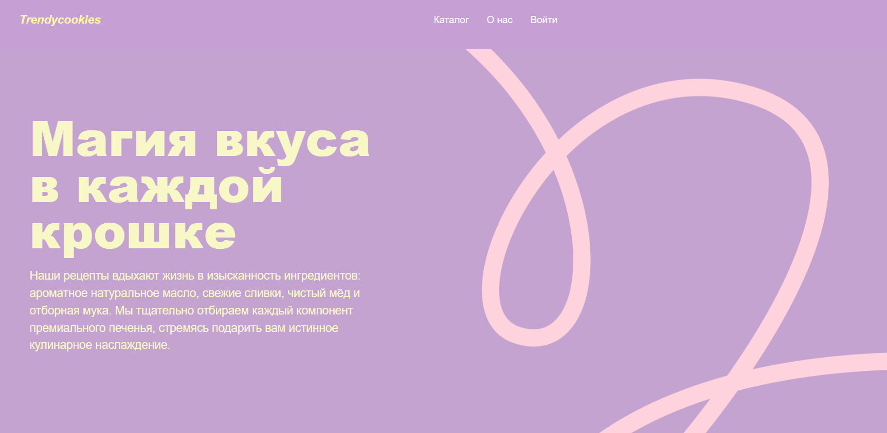
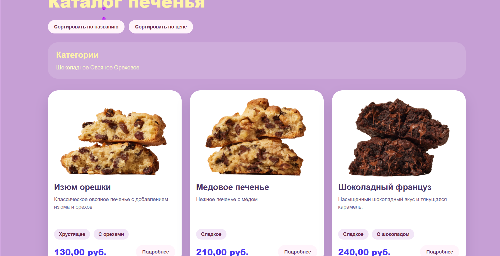
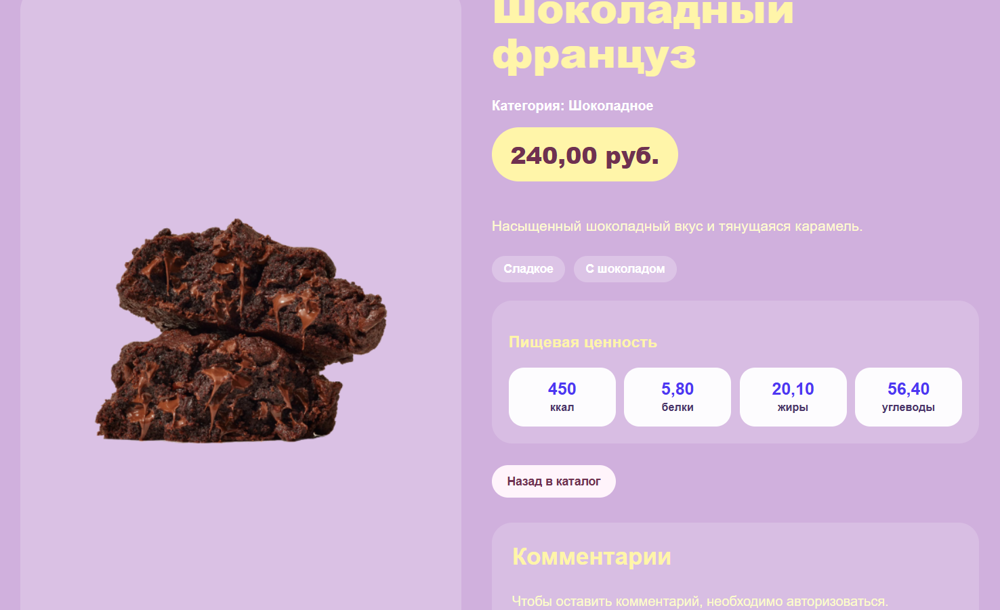
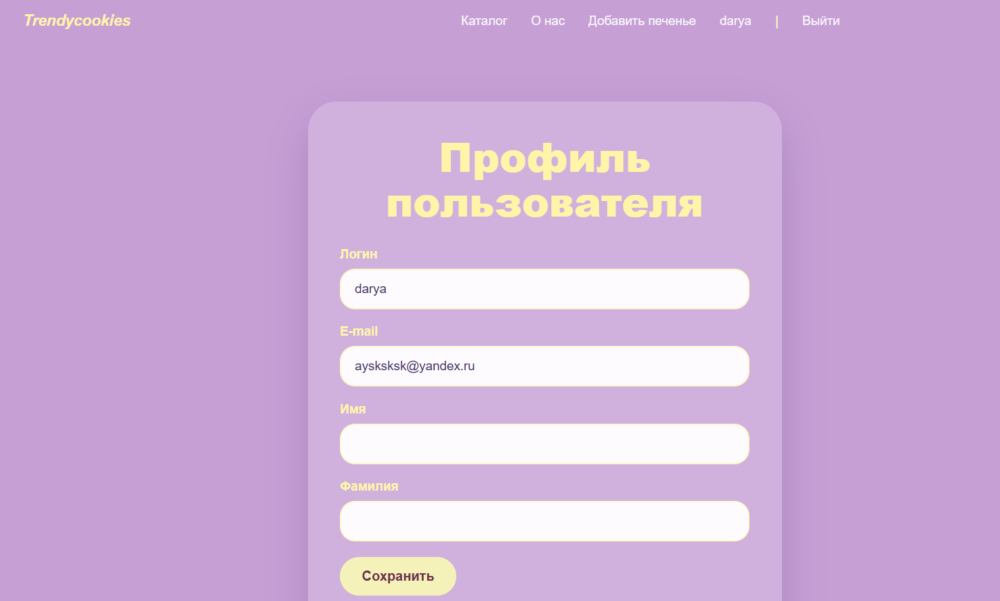
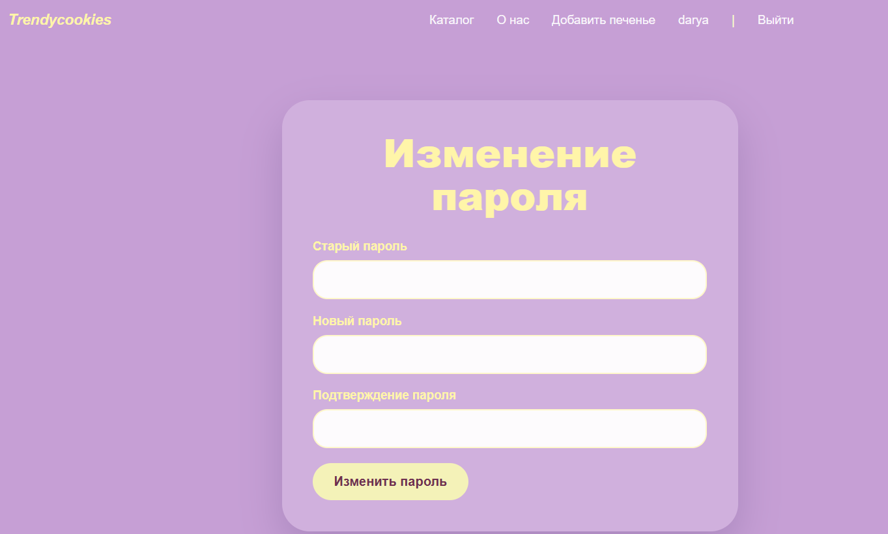

# Trendy Cookies
Полнофункциональное Full Stack веб-приложение на Django для управления каталогом товаров с системой авторизации, пользовательским контентом  и административной панелью.

---
## Автор
Бабаева Дарья Евгеньевна 

Email: darya.babaeva05@gmail.com

GitHub: https://github.com/Ayskwl

tg: @sixmei

---
# О проекте
**Trendy Cookies** — это интерактивное веб-приложение, демонстрирующее полный цикл разработки современного сайта на Django: от проектирования архитектуры и базы данных до реализации пользовательского интерфейса и бизнес-логики.
**Цель проекта:** являлось создание полноценного веб-приложения с разграничением ролей пользователей, системой публикации контента и безопасным взаимодействием между пользователями.

В ходе разработки была реализована серверная часть приложения, включающая работу с базой данных, систему регистрации и авторизации пользователей, обработку пользовательских данных, разграничение прав доступа и административную панель для управления содержимым сайта.
Пользовательский интерфейс разработан с использованием **HTML5**, **CSS3**, **Bootstrap** и шаблонизатора **Django Templates**. Все страницы приложения динамически формируются на основе данных, хранящихся в базе данных, обеспечивая удобную навигацию и единый современный дизайн.

Особое внимание уделялось архитектуре проекта, производительности, безопасности, повторному использованию компонентов и соблюдению рекомендаций Django Framework.

---
# Пользовательский интерфейс (Frontend)
При разработке проекта особое внимание уделялось созданию современного и удобного пользовательского интерфейса.

### Реализовано:

- адаптивная верстка страниц;
- единый стиль оформления приложения;
- использование Bootstrap-компонентов;
- работа с сеточной системой Bootstrap Grid;
- использование Flexbox для построения интерфейсов;
- динамическое отображение данных с помощью Django Templates;
- повторное использование HTML-шаблонов;
- отображение сообщений пользователю;
- удобная навигация между страницами;
- адаптация форм под различные устройства;
- оформление карточек товаров;
- страницы регистрации и авторизации;
- личный кабинет пользователя;
- отображение изображений товаров;
- стилизация кнопок, таблиц и форм;
- интерактивные элементы управления.

<table align="center">
  <tr>
    <td align="center">
       
      <em>Главная страница</em>
    </td>
    <td align="center">
       
      <em>Каталог</em>
    </td>
    <td align="center">
       
      <em>Карточка печенья</em>
    </td>
    <td align="center">
       
      <em>Профиль пользователя</em>
    </td>
    <td align="center">
       
      <em>Смена пароля</em>
    </td>
  </tr>
</table>

---
# ⚙ Backend

Серверная часть приложения реализована на Django Framework.

### Реализовано

- регистрация пользователей;
- авторизация;
- авторизация по электронной почте;
- восстановление пароля;
- смена пароля;
- CRUD-операции;
- работа с ORM;
- обработка пользовательских форм;
- загрузка изображений;
- административная панель;
- система комментариев;
- избранное;
- лайки и дизлайки;
- система разрешений;
- защита пользовательского контента;
- пагинация;
- работа с электронной почтой.

---

# Возможности приложения
## Пользователи

- регистрация;
- авторизация;
- личный кабинет;
- восстановление пароля;
- изменение пароля.

---
## Каталог

- просмотр товаров;
- категории;
- теги;
- карточка товара;
- фотографии;
- описание;
- пищевая ценность.

---
## Пользовательский контент
Авторизованные пользователи могут

- создавать публикации;
- загружать изображения;
- редактировать свои записи;
- удалять собственные записи.

---
## Комментарии

- добавление комментариев;
- отображение автора;
- отображение даты;
- серверная валидация.

---
## Реакции

- лайки;
- дизлайки;
- отмена реакции;
- изменение реакции.

---
## Избранное

- добавление одним нажатием;
- удаление;
- просмотр списка избранного.

---

# Используемые технологии
## Backend

- Python
- Django
- SQLite
- Django ORM
- Class-Based Views
- Function-Based Views
- Forms
- ModelForms
- Authentication
- Authorization
- Email Backend

---
## Frontend

- HTML5
- CSS3
- Bootstrap
- Django Templates
- Flexbox
- CSS Grid
- Адаптивная верстка
- Компонентный подход к построению страниц
- Повторное использование шаблонов

---
## Работа с базой данных

- SQLite
- Django ORM
- ForeignKey
- OneToOne
- ManyToMany
- Миграции

---
# Безопасность
Для обеспечения безопасности приложения использованы встроенные механизмы Django.
Реализованы:

- Authentication;
- Authorization;
- LoginRequiredMixin;
- PermissionRequiredMixin;
- CSRF-защита;
- серверная валидация данных;
- проверка владельца записи;
- ограничение доступа к операциям CRUD.

---
